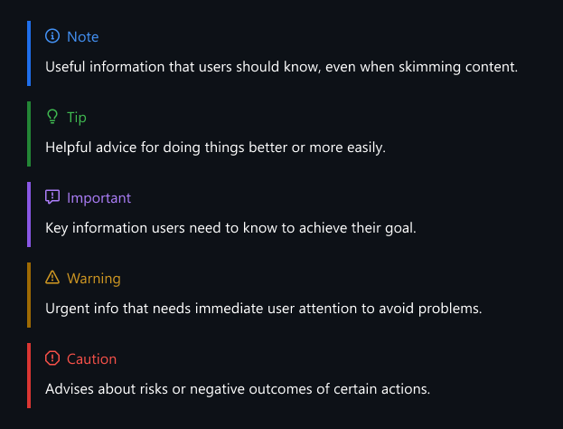

# Enhanced Alert Boxes for Rehype

[![JSR][jsr-badge]][jsr-package]

A [rehype][] plugin enabling [GitHub-style alert boxes][github-alert-docs] in Markdown
with enhanced features and customization.


## What is this?

This [unified][] ([rehype][]) plugin mimics how 
[GitHub renders alert boxes in Markdown][github-alert-docs].
It allows content authors to reuse the blockquote syntax
to annotate alert boxes (a.k.a. callouts, admonitions, asides, info boxes).
In the words of [GitHub Docs][github-alert-docs]:

> Alerts are a Markdown extension based on the blockquote syntax
> that you can use to emphasize critical information.

The plugin scans for blockquote elements in the HTML content
and looks for a special marker `[!TYPE]` at the start of the first line.
When it finds this marker, it transforms the blockquote element
into a different HTML structure which can be styled as an alert box.

This plugin is based on the [rehype-github-alert][] plugin,
but with more features and customization options whether it be simple styling
or a more complex construction of HTML elements representing the alert boxes.


## When should I use this?

This plugin helps you author Markdown content with alert boxes
without having to learn to use a different syntax (like [remark-directive][]).
By sharing the same syntax as GitHub alerts,
you can expect your Markdown content to render properly
both on GitHub and on web platforms you develop.


## Example Usage

Let’s look at how this plugin interacts with Markdown content.
Say our Markdown content looks like this:

```markdown
> [!NOTE]
> Useful information that users should know, even when skimming content.

> [!TIP]
> Helpful advice for doing things better or more easily.

> [!IMPORTANT]
> Key information users need to know to achieve their goal.

> [!WARNING]
> Urgent info that needs immediate user attention to avoid problems.

> [!CAUTION]
> Advises about risks or negative outcomes of certain actions.
```

Without this plugin, the Markdown content would render as a series of blockquotes. Using [remark-rehype][], converting the above Markdown example into HTML would look like this:

```html
<blockquote>
<p>[!NOTE]
Useful information that users should know, even when skimming content.</p>
</blockquote>
<blockquote>
<p>[!TIP]
Helpful advice for doing things better or more easily.</p>
</blockquote>
<blockquote>
<p>[!IMPORTANT]
Key information users need to know to achieve their goal.</p>
</blockquote>
<blockquote>
<p>[!WARNING]
Urgent info that needs immediate user attention to avoid problems.</p>
</blockquote>
```

However, with this plugin enabled, the same Markdown content would be transformed into HTML like this:

```html
<aside class="alert alert--note"><p class="alert-heading"><span class="alert-icon alert--note"></span>Note</p><p>Useful information that users should know, even when skimming content.</p>
</aside>
<aside class="alert alert--tip"><p class="alert-heading"><span class="alert-icon alert--tip"></span>Tip</p><p>Helpful advice for doing things better or more easily.</p>
</aside>
<aside class="alert alert--important"><p class="alert-heading"><span class="alert-icon alert--important"></span>Important</p><p>Key information users need to know to achieve their goal.</p>
</aside>
<aside class="alert alert--warning"><p class="alert-heading"><span class="alert-icon alert--warning"></span>Warning</p><p>Urgent info that needs immediate user attention to avoid problems.</p>
</aside>
<aside class="alert alert--caution"><p class="alert-heading"><span class="alert-icon alert--caution"></span>Caution</p><p>Advises about risks or negative outcomes of certain actions.</p>
</aside>
``` 

If you wish to achieve parity with the GitHub alert boxes (see example below),
you will need to add some CSS styles to your project (e.g. mapping `alert-icon` class with [octicons][]).



However, this plugin provides you with a lot of flexibility. Please refer to the [API documentation](#api) documentation.


## Install

Head over to the [JSR package page][jsr-package] for installation instructions.


## API

Head over to the [JSR package documentation][jsr-doc] for the full API documentation.


## Advanced Features

All plugin features can be configured via options.
They can either be a configuration object or a callback function that returns an HTML element.

```typescript
type Options = SimpleOptions | CreateAlertCallback;

interface SimpleOptions {
  allowedTypes?: boolean | string[];
  allowsCustomHeading?: boolean;
  classPrefix?: string;
}

type CreateAlertCallback = (
  alertType: string,
  displayText: string,
  children: hast.ElementContent[],
) => hast.Element | false;
```

In this section, we will go through the available options and how to use them.

### Feature: custom heading

By default, the plugin allows custom heading right after the alert type marker `[!TYPE]`. For example,

```markdown
> [!NOTE] Important Note
> Useful information that users should know, even when skimming content.
```

Yields:

```html
<aside class="alert alert--note"><p class="alert-heading"><span class="alert-icon alert--note"></span>Important Note</p><p>Useful information that users should know, even when skimming content.</p>
</aside> 
``` 

To disable this feature, set the option `allowsCustomHeading` to `false`.
With this option disabled, the plugin will *not* transform the blockquote into an alert box.

### Feature: add custom alert types

By default, only these alert types are supported (reflecting the original implementation by GitHub):
`note`, `tip`, `important`, `warning`, and `caution`.

To add custom alert types, use the `allowedTypes` option to specify a list of allowed alert types.
If you wish to keep the original alert types, you must also include them in the list.

Suppose that `allowedTypes` is set to `["note", "example"]`. The following Markdown content:

```markdown
> [!NOTE]
> This is a note alert box.

> [!IMPORTANT]
> This is an important alert box.

> [!EXAMPLE]
> This is an example alert box.

> [!THANKS]
> This is a thanks alert box.
```

Yields:

```html
<aside class="alert alert--note"><p class="alert-heading"><span class="alert-icon alert--note"></span>Note</p><p>This is a note alert box.</p>
</aside>
<blockquote>
<p>[!IMPORTANT]
This is an important alert box.</p>
</blockquote>
<aside class="alert alert--example"><p class="alert-heading"><span class="alert-icon alert--example"></span>Example</p><p>This is an example alert box.</p>
</aside>
<blockquote>
<p>[!THANKS]
This is a thanks alert box.</p>
</blockquote>
```

**Important:** Alert type markers in the blockquote content and the list of allowed types in the plugin options
are compared in a case-insensitive manner.
However, the generated class names for the alert types will preserve its original case
as specified in the `allowedTypes` option.
We recommend using lowercase alphabets for the alert type names in the `allowedTypes` option
to maintain consistency and avoid confusion.

**Note:** When custom heading is left unspecified in the blockquote content (or is disabled via the `allowCustomHeading` option),
the plugin will auto capitalize the alert type name as the display heading.

### Feature: allow all alert types

To allow all alert types, set the `allowedTypes` option to the boolean `true`. This will allow any alert type marker in the blockquote content to be transformed into an alert box. Also, the alert type names will be in lowercases when appear in class names.

Continuing from the previous example of the Markdown content, setting `allowedTypes` to `true` will yield:

```html
<aside class="alert alert--note"><p class="alert-heading"><span class="alert-icon alert--note"></span>Note</p><p>This is a note alert box.</p>
</aside>
<aside class="alert alert--important"><p class="alert-heading"><span class="alert-icon alert--important"></span>Important</p><p>This is an important alert box.</p>
</aside>
<aside class="alert alert--example"><p class="alert-heading"><span class="alert-icon alert--example"></span>Example</p><p>This is an example alert box.</p>
</aside>
<aside class="alert alert--thanks"><p class="alert-heading"><span class="alert-icon alert--thanks"></span>Thanks</p><p>This is a thanks alert box.</p>
</aside>
```

**Note:** In case you are curious, the option `allowedTypes` is set to `false` as the default value,
meaning that only the default alert types are allowed.

### Feature: change class name prefix

By default, the plugin uses `alert` as the main class name of the `<aside>` element as well as the prefix for relevant class names such as `alert-icon`, `alert-heading`, `alert--note`, `alert--tip`, etc.

This value can be replaced with a custom value by setting the `classPrefix` option.

For example, setting the `classPrefix` to `callout` will transform:

```markdown
> [!NOTE]
> This is a note alert box.
``` 

into:

```html
<aside class="callout callout--note"><p class="callout-heading"><span class="callout-icon callout--note"></span>Note</p><p>This is a note alert box.</p>
</aside>
```

### Feature: custom HTML element

You can ignore all the above options and provide a custom HTML structure for the alert boxes specifying the callback function as the plugin options.

For example, one might want to create a custom alert box that inlines the body content with the icon.
To achieve this, you can define the callback function like this:

```typescript
import type * as hast from "hast";
import { whitespace } from "hast-util-whitespace";
import { h } from "hastscript";

function createSmallnoteAlert(
  alertType: string,
  displayText: string,
  children: hast.ElementContent[],
): hast.Element | false {
  // Only process alert type called "smallnote"
  if (alertType !== "smallnote") return false;
  // Disallows custom headings (effectively set allowsCustomHeading to false)
  if (!whitespace(displayText)) return false;

  return h(`aside.smallnote`, [
    h(`span.smallnote-icon`),
    " ",
    h("div.smallnote-body", children),
  ]);
}
```

With the above callback function, the following Markdown content:

```markdown
> [!SMALLNOTE]
> Your content goes here.
```

Yields:

```html
<aside class="smallnote"><span class="smallnote-icon"></span> <div class="smallnote-body"><p>Your content goes here.</p></div>
</aside>
```

### Feature: using this plugin more than once

Suppose that you are inspired by [the previous feature](#feature-custom-html-element)
and wish to configure your rehype pipeline to use this plugin twice,
once for the `smallnote` alert type and again for the default set of alert types (very cool idea!).

Due to the way the [unified][] ecosystem works,
typically you cannot repeat the same plugin in the pipeline.
However, this plugin provides a special mechanism to create new instances of the plugin
via the `builder()` function under `@abhabongse/rehype-enhanced-alert/builder` entrypoint.

Hence, you can acheive the aforementioned goal by doing the following:

```typescript
import { builder as rehypeEnhancedAlert } from "@abhabongse/rehype-enhanced-alert/builder";

```  


<!-- Definitions -->

[esm.sh]: https://esm.sh/

[github-alert-docs]: https://docs.github.com/en/get-started/writing-on-github/getting-started-with-writing-and-formatting-on-github/basic-writing-and-formatting-syntax#alerts

[jsr-badge]: https://jsr.io/badges/@abhabongse/rehype-enhanced-alert

[jsr-doc]: https://jsr.io/@abhabongse/rehype-enhanced-alert/doc

[jsr-package]: https://jsr.io/@abhabongse/rehype-enhanced-alert

[octicons]: https://github.com/primer/octicons

[rehype]: https://github.com/rehypejs/rehype

[rehype-github-alert]: https://github.com/rehypejs/rehype-github/tree/main/packages/alert

[remark-directive]: https://github.com/remarkjs/remark-directive

[remark-rehype]: https://github.com/remarkjs/remark-rehype

[unified]: https://github.com/unifiedjs/unified

